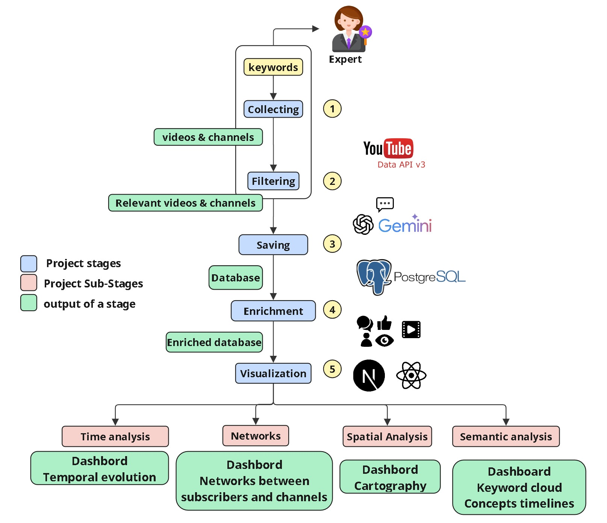

    

    
    

# STAYApp

Welcome to a tool for **temporal**, **spatial**, **relational**, and **semantic** analysis of knowledge shared on **YouTube** about the phenomenon of **self-sufficiency in France**, developed as part of the **STAY project** (**Technical Knowledge for Self-Sufficiency on YouTube**).

This work is situated within an **unstable global context**, marked by **health crises** (such as the **COVID-19 pandemic**), **geopolitical tensions** (such as the **war in Ukraine**), and **environmental challenges** (linked to **climate change**). These factors have contributed to a growing awareness around issues of **autonomy** and **sovereignty**—whether **food-related**, **energy-related**, or otherwise.

The project also contributes to the creation of a **FAIR** (**Findable, Accessible, Interoperable, Reusable**) **database**, which can be used by other **researchers** or **local stakeholders** seeking to understand or engage with the dynamics of this **social phenomenon**.

## General Pipeline

    

## Demo

https://github.com/user-attachments/assets/43426bf5-b659-47d9-b889-79e475825a61
